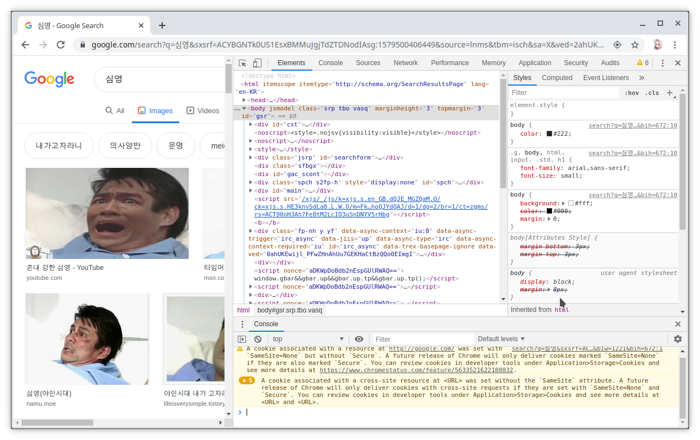
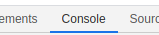
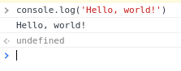

> 항상 강좌 맨 밑에는 요약을 해뒀으니, 시간이 모자란 사람은 읽어라

# [ JS ] 1. Hello, world!
## ㅎㅇ, 너의 선생 PMH이다
너가 여기서 배우게 될 것은 JavaScript라는 엄청난 언어이다<br />

간단하게 자바스크립트(JavaScript, JS)를 설명하자면...

- 쉽다
- 쓸때가 많다
- 그냥 외국인들이 많이 쓴다

이정도 된다<br />
그중에서 가장 중요한것은 "**쓸때가 많다**" 이다<br />
너는 이 언어를 배우기만 하면 뭐든지 만들 수 있을 것이다<br />


-----------------------------------------------------------

## 자 그럼 얼마나 쉬운지 알아보자
```js
console.log('Hello, world!')
```
이것을 실행하면 Hello, world!가 출력된다<br />
이게 쉬운건지 모르겠다고?<br />

자 그럼 똑같은 일을 하는 다른 언어를 보자
```c
// C언어
#include <stdio.h>

int main() {
  printf("Hello, world!\n");
  return 0;
}
```


ㅓㅜㅑ, 너무 길다<br />
뭔 개소리인지 모르겠다

JAVA나 C# 같은걸로 하면 더 길어진다<br />
~~Python 같은걸로 하면 더 짧은거 안다, 근데 JS 자존심 상하니까 건들진 말자~~

## 구라치는거 아니냐고?
아는척 하는거라면서 구라치는줄 아는놈 있다<br />
그런놈들을 위해 직접 실행해보자<br />

1. 심영이를 검색해보자
  
2. 키보드에 `F12` 버튼을 잘 찾아서 누르면 이상한 창이 뜬다
  
3. 뇌가 존재한다면 console을 누를것이다
  
4. `console.log('Hello, world!')`를 적고 엔터를 쳐보자
5. 잘 된다! 

## 해석해보자
```js
console.log('Hello, world!')
```
영어 고자가 아닌 이상 바로 알아볼 순 있겠지만<br />
영포자를 위해 해석해 보도록 하겠다<br />

| 글자 | 한국어 번역 | 기능 |
| ---- | ----------- | ---- |
| console | 콘솔 | 너가 아까 킨 창을 의미한다 |
| log | 기록하다 | 너가 아까 킨 창에 기록을 한단 소리다 |
| Hello, world! | 안녕 세상! | 기록할 글자이다 |

그렇다<br />
`console.log('하고싶은말')`은 너가 하고 싶은 말을 창에 글자가 기록 한다는 뜻이다<br />

오늘의 수업은 끝이다

----------------------------------

# 요약
JavaScript에서 사용자에게 글자를 보여주려면
```js
console.log('하고 싶은말')
```
을 사용한다

# [이전 강좌](README.md) [다음 강좌](2.%20yes%20or%20no.md)
